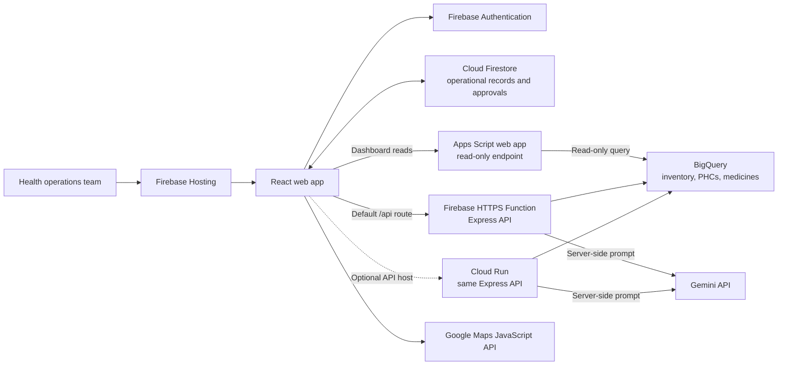

# SwasthyaSetu-AI

## Brief Description

SwasthyaSetu AI is an India-focused PHC operations prototype that surfaces medicine stock-out risks and helps teams coordinate human-reviewed redistribution across facilities.
It combines Firebase, BigQuery, a BigQuery ML demand-forecast pipeline, and server-side Google Gemini explanations, with realistic synthetic data spanning multiple states and Hindi/Tamil alert support.

# Architecture Overview



Firebase Hosting serves the web app and rewrites `/api` requests to the Firebase
HTTPS Function by default. The same Express API can be deployed to Cloud Run as
an alternative host. Dashboard reads use the Apps Script endpoint when it is
configured; that endpoint queries BigQuery with read-only access. Firestore
holds operational records and transfer approvals. The API connects to BigQuery
and, when configured, calls Gemini for alert explanations. Gemini credentials
stay on the server and are never exposed to the browser. Google Maps renders
PHC locations in the map view.

The no-billing Apps Script dashboard calculates stock risk from current stock
and consumption; it does not query BigQuery ML forecasts. Gemini features also
depend on the API being deployed with a Gemini API key. The UI has a local
fallback when AI is unavailable.

## Prototype Features

- **Inventory overview:** Compare PHC medicine stock, predicted daily demand,
  days remaining, and risk; filter by state, district, and risk level.
- **Stock-out alerts:** Review critical and warning facilities, inspect alert
  details, and request an explanation where the AI backend is available.
- **Emergency simulation:** Preview demand and risk changes for dengue,
  diarrhoea, heatwave, or flu scenarios. This is a demo simulation; it does not
  change the source inventory in BigQuery.
- **Medicine redistribution:** Generate a suggested transfer from a nearby
  surplus facility, then review, approve, reject, and track its status.
- **National PHC map:** Explore facilities and risk by geography, medicine, and
  risk category using Google Maps.
- **Role-aware operations:** Operations Managers can manage district and supply
  records; Response Viewers can monitor and raise transfer requests.
- **District setup:** Add a district, PHC coordinates, and starting medicine
  supply records to Firestore.

For a ready-to-read recording walkthrough, see [docs/demo_script.md](docs/demo_script.md).

## Current prototype access

The frontend is currently configured for demo mode. It opens directly as the
**Prototype Operations Manager**, so the dashboard, alerts, transfers, national
map, emergency simulation, and district setup flows can be demonstrated without
a sign-in screen. The prototype operations profile has permission to manage
districts, generate transfer plans, and approve transfers.

The application still defines two role profiles for the authenticated version:
**Operations Manager** and **Response Viewer**. Viewer access is read-oriented;
it can monitor the dashboard and alerts and raise transfer requests, but cannot
update stock, manage districts, generate plans, or approve transfers. Demo mode
should be disabled before using the application as a production system.

## Run the frontend

```bash
cd frontend
npm install
npm run dev             # start the Vite development server
npm run build           # create a production build
npm run lint            # run Oxlint
```

The frontend uses the Firebase configuration in `frontend/src/firebase.js` and
the API/data-source settings described below. Google Maps features require a
configured Maps JavaScript API key.

---

## API data sources (read path)

The Apps Script endpoint in `apps-script/Code.gs` serves the hosted dashboard's
read-only BigQuery data. The Express API in `functions/` remains the full local
API implementation and can be deployed separately to Cloud Run when billing is
available.

| Data | Primary source | Fallbacks |
| --- | --- | --- |
| Live stock / staff telemetry (`GET /dashboard`, `GET /alerts`, `POST /recommendation`) | `swasthya_ai.current_inventory` | Firestore `current_inventory` -> in-memory seed |
| Live dashboard (`GET /dashboard`) | Apps Script query of `swasthya_ai.current_inventory`, joined with `phcs` and `medicines` | none |
| Express API reads and writes | BigQuery | Firestore -> in-memory seed where implemented |
| Forecast risk in no-billing dashboard | Computed from stock / daily consumption | BigQuery ML forecast is not queried by Apps Script |

The full Express API still contains the write, alert, transfer, Gemini, and
translation endpoints. They are not served by the Apps Script read-only endpoint.
The web app no longer exposes a PHC telemetry data-entry screen; `POST /phcUpdate`
remains available for existing external integrations and local API tests.

The Apps Script endpoint returns a bounded inventory snapshot and dashboard
summary. It does not expose arbitrary query parameters or BigQuery write access.

```bash
cd functions
npm run start             # node server.js -> http://localhost:8080
npm run test:all          # 28 smoke + 19 BigQuery write + 29 BigQuery read checks
npm run probe:bq          # verify dataset tables/schema against the real project
```

## Deploy the no-billing dashboard endpoint

See [apps-script/README.md](apps-script/README.md) for the Apps Script deployment,
authorization, and frontend configuration steps. The deployed script runs as its
owner and is publicly callable, so only use it with dashboard data that is safe to
show publicly. BigQuery Sandbox and Apps Script quotas apply.

---
